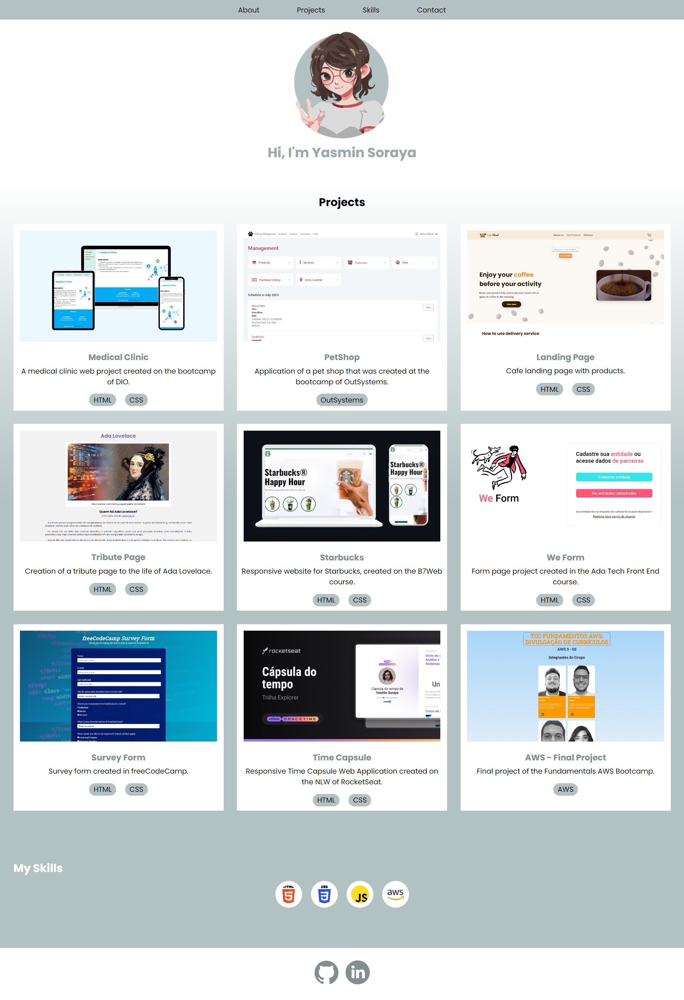

    

## 💻 Projeto
Esse é um projeto Web responsivo de uma página de portfólio.

## 🚀 Tecnologias
Esse projeto foi desenvolvido durante o freeCodeCamp com as seguintes tecnologias:
- HTML
- CSS

## 🏷 Tecnologias
Você pode visualizar o layout de inspiração do projeto através [desse link](https://personal-portfolio.freecodecamp.rocks/).
